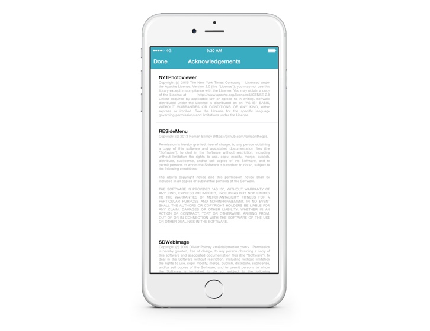

#LicenseGenerator iOS
Recursively finds all `LICENSE.*` files in a given directory and generates a `Settings.bundle` friendly plist.

The script can help ensure that the license section of your app is always up to date. Since it searches recursively the script works well with cocoapods projects. It assumes that the parent directory of the `LICENSE` file is also the name of the library to be credited.

Inspired by JosephH and Sean's comments on [stackoverflow](http://stackoverflow.com/q/6428353).

##Usage as xcode build script

* Copy `credits.py` to the your project root
* Open your project, select your **Target** and select **Build Phases**
* Add a new **Run Script Phase** after target dependencies
* Add something like: `./credits.py -s $SRCROOT -o $SRCROOT/MyProj/Settings.bundle/Credits.plist`
* Build & profit

##Excluding Directories
You can optionally tell the generator to ignore certain paths. To do so use the `-e` option and pass it a comma seperated list of path fragments. 

##Contact
Twitter: [@carloeugster](https://twitter.com/carloeugster)
Email: [carlo@relaun.ch](mailto:carlo@relaun.ch)

##License
MIT