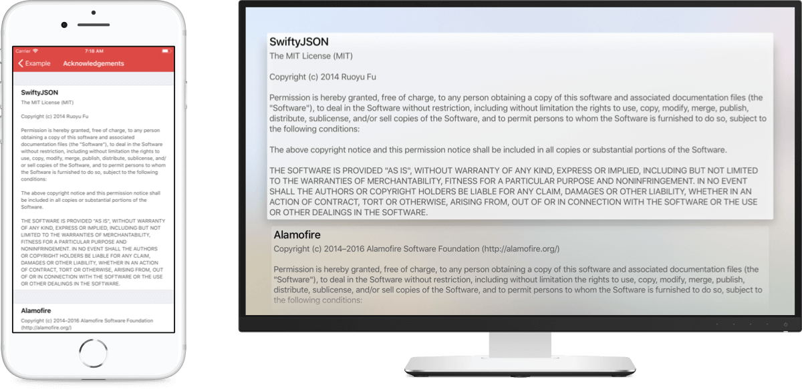

# LicenseGenerator iOS

[](https://travis-ci.org/carloe/LicenseGenerator-iOS)
[](http://cocoapods.org/pods/LicensesViewController)
[](https://swift.org/blog/swift-4-0-released/)
[](http://cocoapods.org/pods/LicensesViewController)
[](http://cocoapods.org/pods/LicensesViewController)

Recursively finds all `LICENSE.*` files in a directory and generates a plist that can be displayed in `Settings.bundle` or the provided view controller.



The script can help ensure that the license section of your app is always up to date. Since it searches recursively the script works well with cocoapods projects.

Inspired by JosephH and Sean's comments on [stackoverflow](http://stackoverflow.com/q/6428353).

## Build Script

The build script recursively searches the project for `LICENSE` files and generates a plist that can be used in a `Settings.bundle`. The script assumes that the parent directory of the `LICENSE` file is also the name of the library to be credited.

#### Usage

* Copy `credits.py` to the your project root
* Open your project, select your **Target** and select **Build Phases**
* Add a new **Run Script Phase** after target dependencies
* Add something like: `./credits.py -s "$SRCROOT" -o "$SRCROOT/Project/Settings.bundle/Credits.plist"`
* Build & profit

#### Excluding Directories
You can optionally tell the generator to ignore certain paths. To do so use the `-e` option and pass it a comma separated list of path fragments.

## View Controller
If your app doesn't use a `Settings.bundle` you can use the provided view controller to show the licenses.

#### Installation

Add LicensesViewController to your `Podfile`:

```ruby
source 'https://github.com/CocoaPods/Specs.git'
platform :ios, '8.0'
use_frameworks!

pod 'LicensesViewController', '~> 0.6.5'
```

Then tell Pod to install it:

```bash
$ pod install
```

Grab `credits.py` from this repo and add it to your project.

#### Usage

Add the build script as described above and make sure the resulting plist is included in the app target.

```swift
import LicensesViewController

// ...

let licensesController = LicensesViewController()
licensesController.loadPlist(NSBundle.mainBundle(), resourceName: "Credits")

// ...
```

#### Example Project

```bash
git clone https://github.com/carloe/LicenseGenerator-iOS.git
cd LicenseGenerator-iOS/Example
pod install
open LicensesViewControllerExample.xcworkspace
```

#### Requirements
* iOS `8.0`
* tvOS `9.0`
* Swift `4.0`

## Contact
Twitter: [@carloeugster](https://twitter.com/carloeugster)
Email: [carlo@relaun.ch](mailto:carlo@relaun.ch)

## License
MIT
